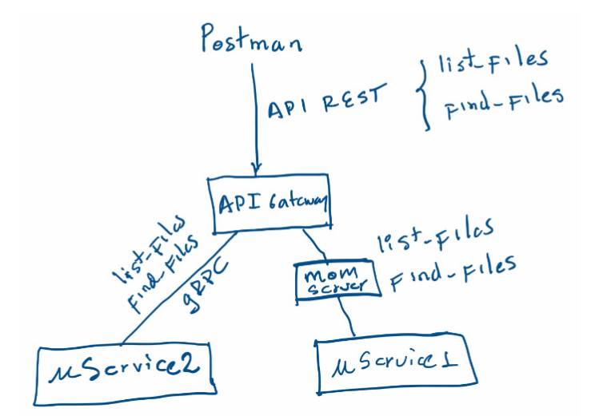
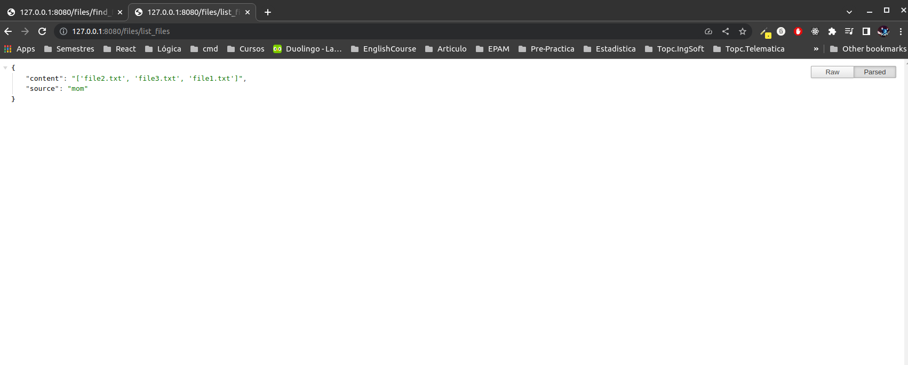
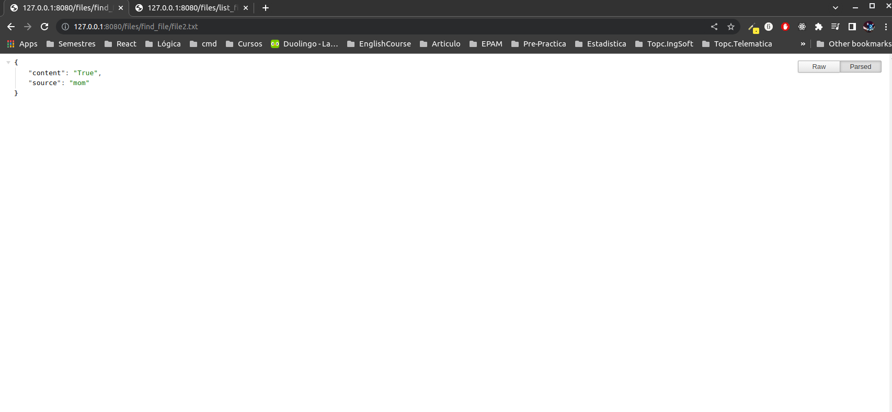

## ST0263, Topicos especiales en Telematica
##
## Estudiante(s): Tomas Atehortua Ceferino, tatehortuc@eafit.edu.co
##
## Profesor: Edwin Nelson Montoya Munera, emontoya@eafit.edu.co
##

## MoM and gRPC challenge 02
##
## 1. Breve descripción de la actividad
Realizar el diseño e implementación de mínimo 2 microservicios básicos que ofrecen ambos un servicio al API Gateway y que se deben comunicar por un middleware RPC y por un middleware MOM. Cada uno de los microservicios debe soportar concurrencia, es decir, permitir a más de un proceso remoto comunicarse simultáneamente.

Para la comunicación RPC se debe utilizar el middleware gRPC y para la comunicación MOM utilizará RabbitMQ o Apache Kafka.
A nivel de lógica de negocio, se debe implementar una o más consultas acerca de los recursos que tiene el otro proceso. Se recomienda que a nivel de recursos sean los archivos que cada uno de los procesos representa. Por ahora, solo se compartirá el índice o listado de los archivos que posee, no se trata de transferencia ni de sincronización de archivos. 

Implementará al menos
- Dos (2) servicios: serv1: listar archivos y serv2: buscar uno o más archivos.
- Cada uno de los procesos tendrá un archivo de configuración que leerá dinámicamente cuando suba el proceso. En el archivo de configuración mínimo contendrá:
    - IP sobre la que hará listening (ej: 0.0.0.0)
    - Port sobre el que hará listening (depende del middleware)
    - Directorio sobre el que listará o buscará archivos.
    - Para probar las funcionalidades de cada uno de los procesos, se implementará un API Gateway que expondrá API REST en una tecnología y servidor tradicional de su preferencia (ej: NodeJS-express, Python-Flask).
    - Realice todas las adecuaciones o variantes que desee de acuerdo con sus intereses académicos o profesionales, o impleméntelo como dice el enunciado.

### 1.1. Que aspectos cumplió o desarrolló de la actividad propuesta por el profesor (requerimientos funcionales y no funcionales)
Todos los servicios fueron implementados. Un cliente puede consumir la API rest para buscar y listar archivos con la ayuda de nuestros servicos, el balanceador de carga funciona correctamente tanto para MOM y GRPC, dando estos respuesta en formato JSON siempre que se les hace request.

### 1.2. Que aspectos NO cumplió o desarrolló de la actividad propuesta por el profesor (requerimientos funcionales y no funcionales)
El archivo de configuracion si fue realizado, se hicieron pruebas en amazon aws EC2 corriendo el servicio. Mas sin embargo el script para hacer el Bootstrap cada que la aplicacion se quiere correr en una instancia no esta configurado por el momento. 

## 2. información general de diseño de alto nivel, arquitectura, patrones, mejores prácticas utilizadas.
La arquitectura implentada es la siguiente:


El servidor principal es una API REST con los servicios de list_files and find_files, este servidor balancea las peticiones a dos microservicios segun su middleware (MOM y GRPC). El balanceo se hizo mediande round-robin, es decir, una peticion ira al microservicio01 (MOM) y la siguiente al microservicio02 (GRPC) y asi sucesivamente.

En cuanto a buenas practicas se realizaron las siguientes:
- Separacion de depencias
- Nombres significativos
- Evitar duplicacion
- Codigo simple

## 3. Descripción del ambiente de desarrollo y técnico: lenguaje de programación, librerias, paquetes, etc, con sus numeros de versiones.
El ambiente utilizado fue python, por lo que, para la API rest se utilizo Flask y para el middleware MOM, rabbitMQ. 

**Dependencias y versionamiento**
- Python: 3.10.6
- RabbitMQ: 3.9.13
- grpcio: 1.43.0
- grpcio-tools: 1.43.0
- pika: 1.3.1
- flask: 2.2.3

**Como se compila y ejecuta.**
Se debe contar con python y rabbitmq instalado en la maquina. En caso de tenerlos, para el caso de `ubuntu` ejecutar lo siguiente: 

Para rabbitmq:
```
sudo apt-get install rabbitmq-server
sudo system ctl start rabbitmq-server
sudo system ctl enable rabbitmq-server
```
Para python:
```
sudo apt update
sudo apt install -y python3-pip
```

Para ejecuar el servicio, como no se han desarrollado scripts de ejecucion, seguir los siguientes pasos:

1. Creacion y activacion de ambiente para python:
```
python3 -m venv env
source env/bin/activate
```
2. Instalar dependencias:
```
pip3 install -r requirements.txt
```
3. Ejecutar los servicios. 

Iniciaremos con el MOM. Para ellos vamos a `rabbitmq/FileUService` y encendemos el microservicio con el comando:
```
python3 main.py
```
y lo dejamos corriendo.

Para el servidor de GRPC es similar. Para ello vamos a `grpc/FileUService` y encendemos el microservicio con el comando:
```
python3 main.py
```
tambien lo dejamos encendido.

Finalmente para encender la API geteway, en la ruta `apigateway/` ejecutamos:
```
python3 app.py
```
Y ya tendriamos nuestro servidor corriendo con sus respectivos microservicios listos para ser consumidos.

**Descripción y como se configuracion**
 los parámetros del proyecto (ej: ip, puertos, conexión a bases de datos, variables de ambiente, parámetros, etc)

**Detalles de la organización del código por carpetas**
 o descripción de algún archivo. (ESTRUCTURA DE DIRECTORIOS Y ARCHIVOS IMPORTANTE DEL PROYECTO, comando 'tree' de linux)
 
**Resultados**
A continuacion podemos observar los dos servicios funcionando.
- Servicio list_files:



- Servicio find_files:



## 4. Descripción del ambiente de EJECUCIÓN (en producción) lenguaje de programación, librerias, paquetes, etc, con sus numeros de versiones.

<!-- ## IP o nombres de dominio en nube o en la máquina servidor.

### descripción y como se configura los parámetros del proyecto (ej: ip, puertos, conexión a bases de datos, variables de ambiente, parámetros, etc)

### como se lanza el servidor.

### una mini guia de como un usuario utilizaría el software o la aplicación

### opcionalmente - si quiere mostrar resultados o pantallazos  -->

## Referencias:
Algunos sitios que me fueron de ayuda fueron:
- [RabbitMQ Tutorial](https://www.rabbitmq.com/tutorials/tutorial-six-python.html)
- [Protobufs tutorial](https://www.tutorialspoint.com/protobuf/index.htm)
- [Flask documentation](https://flask.palletsprojects.com/en/2.2.x/tutorial/)
- [Currying](https://en.wikipedia.org/wiki/Currying)