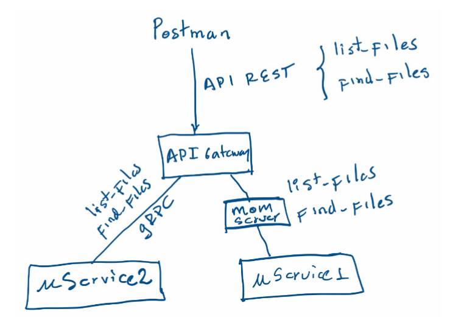
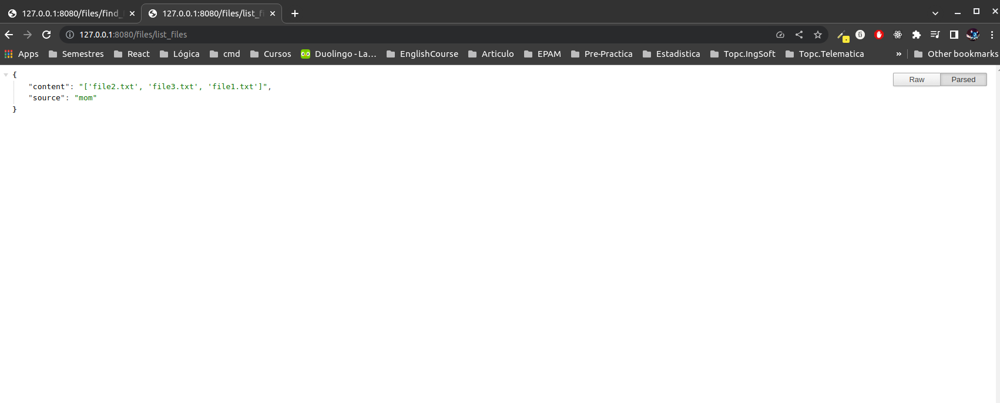
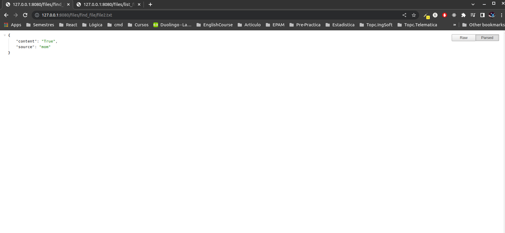

## ST0263, Tópicos especiales en Telemática
##
## Estudiante(s): Tomas Atehortua Ceferino, tatehortuc@eafit.edu.co
##
## Profesor: Edwin Nelson Montoya Munera, emontoya@eafit.edu.co
##

## Challenge 02, MoM and gRPC
##
## 1. Breve descripción de la actividad.
Realizar el diseño e implementación de mínimo 2 microservicios básicos que ofrecen ambos un servicio al API Gateway y que se deben comunicar por un middleware RPC y por un middleware MOM. Cada uno de los microservicios debe soportar concurrencia, es decir, permitir a más de un proceso remoto comunicarse simultáneamente.

Para la comunicación RPC se debe utilizar el middleware gRPC y para la comunicación MOM utilizará RabbitMQ o Apache Kafka.
A nivel de lógica de negocio, se debe implementar una o más consultas acerca de los recursos que tiene el otro proceso. Se recomienda que a nivel de recursos sean los archivos que cada uno de los procesos representa. Por ahora, solo se compartirá el índice o listado de los archivos que posee, no se trata de transferencia ni de sincronización de archivos. 

Implementará al menos
- Dos (2) servicios: serv1: listar archivos y serv2: buscar uno o más archivos.
- Cada uno de los procesos tendrá un archivo de configuración que leerá dinámicamente cuando suba el proceso. En el archivo de configuración mínimo contendrá:
    - IP sobre la que hará listening (ej: 0.0.0.0)
    - Port sobre el que hará listening (depende del middleware)
    - Directorio sobre el que listará o buscará archivos.
    - Para probar las funcionalidades de cada uno de los procesos, se implementará un API Gateway que expondrá API REST en una tecnología y servidor tradicional de su preferencia (ej: NodeJS-express, Python-Flask).
    - Realice todas las adecuaciones o variantes que desee de acuerdo con sus intereses académicos o profesionales, o impleméntelo como dice el enunciado.

### 1.1. Qué aspectos cumplió o desarrolló de la actividad propuesta por el profesor (requerimientos funcionales y no funcionales).
Todos los servicios fueron implementados. Un cliente puede consumir la API rest para buscar y listar archivos con la ayuda de nuestros servicos, el balanceador de carga funciona correctamente tanto para MOM y GRPC, dando estos respuesta en formato JSON siempre que se les hace request.

## 2. Información general de diseño de alto nivel, arquitectura, patrones, mejores prácticas utilizadas.
La arquitectura implentada es la siguiente:


El servidor principal es una API REST con los servicios de list_files and find_files, este servidor balancea las peticiones a dos microservicios segun su middleware (MOM y GRPC). El balanceo se hizo mediante round-robin, es decir, una petición irá al microservicio01 (MOM) y la siguiente al microservicio02 (GRPC) y así sucesivamente.

En cuanto a buenas prácticas se realizó:
- Separación de dependencias
- Nombres significativos
- Evitar duplicación
- Código simple

## 3. Descripción del ambiente de desarrollo y técnico.

El ambiente utilizado fue python, por lo que, para la API rest se utilizo Flask y para el middleware MOM, rabbitMQ. 

**Dependencias y versionamiento**
- Python: 3.10.6
- RabbitMQ: 3.9.13
- grpcio: 1.43.0
- grpcio-tools: 1.43.0
- pika: 1.3.1
- flask: 2.2.3

**Como se compila y ejecuta.**

Para ejecutar el servicio, seguir los siguientes pasos:

Se debe contar con python y rabbitmq instalado en la máquina.


1. Instalación y activación de recursos necesarios:

Se debe contar con python y rabbitmq instalado en la máquina. Para el caso de una nueva instancia se debe ejecutar el siguiente comando, el cual descargara y activara lo necesario para nuestro servicio.
```
./firs-time-install
```

2. Ejecutar los servicios. 

Para iniciar los servicios nos ubicamos en el directorio raíz del repositorio y ejecutaremos el siguiente script bash:
```
./bootstrap.sh
```
Esto pondrá a ejecutar nuestros 2 microservicios y nuestra API gateway en funcionamiento.

**Configuración**

La configuración correspondiente a los diferentes puertos y dirección host, tanto de los microservicios como la API, se puede encontrar en el archivo `config.json` en el directorio raíz de este repositorio.

**Detalles de la organización del código por carpetas**

Para separar responsabilidades se decidió hacer tres carpetas (apigateway, grpc, y rabbitmq). A continuación se explicará que se encuentra en cada una de estas.

En la carpeta `./apigateway` se puede encontrar todo lo que le corresponde al servidor principal, es decir, la API rest.

En la carpeta `./grpc/FileUService` podemos encontrar lo correspondiente al microservicio02 (GRPC).

Para finalizar, en el directorio `./rabbitmq/FileUService` se encuentra el microservicio01 (MOM)
 
**Resultados**

A continuación podemos observar los dos servicios funcionando.
- Servicio list_files:



- Servicio find_files:



## 4. Descripción del ambiente de EJECUCIÓN (en producción).

El despliegue se hizo a con la ayuda de AWS, para ello se creó una máquina EC2 con ubuntu instalado. Al crearla, esta fue configurada con los puertos necesarios para el correcto funcionamiento del servicio ("8080","5672" y "50051"), además de los puertos http y https para la comunicación a través de la web.

Para ponerla en funcionamiento se clonó este repositorio en la instancia creada, se ejecutaron los scripts de configuracion `first-time-install.sh` `bootstrap.sh` y estaba lista para su consumo.

Ya con la aplicación funcionando fácilmente podemos acceder a la dirección pública de nuestra EC2 y consumir nuestros dos microservicios a través de esta.

Es importante mencionar que el servidor solo está en la capacidad de responder a las dos siguientes URL:
- `{public_ip_ec2:port}/files/list_files` para listar los archivos
- `{public_ip_ec2:port}/files/find_file/{name_file}` para buscar archivos

## Referencias:
Algunos sitios que me fueron de ayuda fueron:
- [RabbitMQ Tutorial](https://www.rabbitmq.com/tutorials/tutorial-six-python.html)
- [Protobufs tutorial](https://www.tutorialspoint.com/protobuf/index.htm)
- [Flask documentation](https://flask.palletsprojects.com/en/2.2.x/tutorial/)
- [Currying](https://en.wikipedia.org/wiki/Currying)