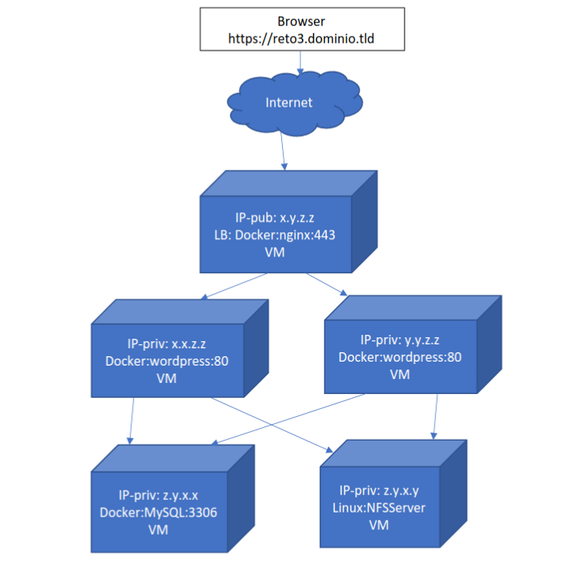

## info de la materia: ST0263, Topicos especiales en Telematica
##
## Estudiante(s): Tomas Atehortua Ceferino, tatehortuc@eafit.edu.co
##
## Profesor: Edwin Nelson Montoya Munera, emontoya@eafit.edu.co
##

## Wordpress distributed deployment
##
## 1. Breve descripción de la actividad
##
Desplegar un CMS wordpress empleando la tecnología de contenedores, con su propio dominio y certificado SSL. El sitio lo llamará: reto3.sudominio.tld.
En este reto3 utilizará un nginx COMO BALANCEADOR DE CARGAS (LB) de la capa de aplicación del wordpress.
Además de lo anterior, se utilizarán 2 servidores adicionales, uno para BASE DE DATOS (DBServer) y otro para ARCHIVOS(FileServer). El DBServer podrá utilizar la BD en docker (recomendado) o nativa. Y el FileServer implementará un NFSServer.

### 1.1. Que aspectos cumplió o desarrolló de la actividad propuesta por el profesor (requerimientos funcionales y no funcionales)
Se cumplió con:

- Implementar un balanceador de cargas basado en nginx que reciba el tráfico web https de
Internet con múltiples instancias de procesamiento.
- Tener 2 instancias de procesamiento wordpress detrás del balanceador de cargas.
- Tener 1 instancia de bases de datos mysql
- Tener 1 instancia de archivos distribuidos en NFS

### 1.2. Que aspectos NO cumplió o desarrolló de la actividad propuesta por el profesor (requerimientos funcionales y no funcionales)
No se cumplió con:
- La página no renderiza el JavaScript y el CSS a través del servidor nginx con HTTPS

## 2. Información general de diseño de alto nivel, arquitectura, patrones, mejores prácticas utilizadas.
Arquitectura: 

## 3. Descripción del ambiente de desarrollo y técnico: lenguaje de programación, librerias, paquetes, etc, con sus numeros de versiones.

### Como se compila y ejecuta.
    Cada instancia tiene su docker-compose correspondiente, para ejecutarlo solo se debe lanzar el contonedor de docker con el correspondiente docker-compose
### Detalles del desarrollo.

### Detalles técnicos
Versionamiento:
    - docker-compose :  '3.1'

## 4. Descripción del ambiente de EJECUCIÓN (en producción) lenguaje de programación, librerias, paquetes, etc, con sus numeros de versiones.

### Como se lanza el servidor.
El despliegue se realizó a través de GCP, para lanzarlo, se debe ir al proyecto donde están las VM y ejecutar cada una de ellas.

### Opcionalmente - si quiere mostrar resultados o pantallazos 
Resultados adquiridos:

## 5. otra información que considere relevante para esta actividad.

## Referencias:

### https://www.tomas-a.online/ 
### https://www.digitalocean.com/community/tutorials/how-to-secure-nginx-with-let-s-encrypt-on-ubuntu-22-04
### https://www.digitalocean.com/community/tutorials/how-to-set-up-an-nfs-mount-on-ubuntu-20-04-es

#### versión README.md -> 1.0 (2023-agosto)